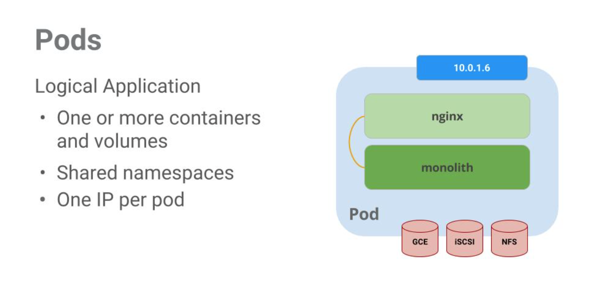

# Ungraded Lab - Orchestrating the Cloud with Kubernetes

In this lab, you will:

* provision a complete Kubernetes cluster using Kubernetes Engine

* deploy and manage Docker containers using kubectl.

* break an application into microservices using Kubernetes' Deployments and Services.

These will help you become familiar with the commands to create and manage the Kubernetes clusters in this week's assignment.

**Note**: [App](https://github.com/kelseyhightower/app) is hosted on GitHub and provides an example 12-Factor application. During this lab you will be working with the following Docker images:

* [kelseyhightower/monolith](https://hub.docker.com/r/kelseyhightower/monolith) - Monolith includes auth and hello services.
* [kelseyhightower/auth](https://hub.docker.com/r/kelseyhightower/auth) - Auth microservice. Generates JWT tokens for authenticated users.
* [kelseyhightower/hello](https://hub.docker.com/r/kelseyhightower/hello) - Hello microservice. Greets authenticated users.
* [nginx](https://hub.docker.com/_/nginx) - Frontend to the auth and hello services.

For this lab, using a managed environment such as Kubernetes Engine allows you to focus on experiencing Kubernetes rather than setting up the underlying infrastructure.

# Setup and requirements

1. Get access ot GCP
2. Activate Cloud Shell
3. Google Kubernetes Engine
    In the cloud shell environment type the following command to set the zone:

    ```bash
    gcloud config set compute/zone us-central1-b
    ```

    Start up a cluster for use in this lab:

    ```bash
    gcloud container clusters create io
    ```

    You are automatically authenticated to your cluster upon creation. If you lose connection to your Cloud Shell for any reason, run the gcloud container clusters get-credentials io command to re-authenticate.

    **Note**: It will take a while to create a cluster - Kubernetes Engine is provisioning a few Virtual Machines behind the scenes for you to play with!

# Task 1. Get the sample code

1. Copy the source code from the Cloud Shell command line:

```bash
gsutil cp -r gs://spls/gsp021/* .
```

2. Change into the directory needed for this lab:

```bash
cd orchestrate-with-kubernetes/kubernetes
```

3. List the files to see what you're working with:

```bash
ls
```

The sample has the following layout:

```bash
deployments/  /* Deployment manifests */
  ...
nginx/        /* nginx config files */
  ...
pods/         /* Pod manifests */
  ...
services/     /* Services manifests */
  ...
tls/          /* TLS certificates */
  ...
cleanup.sh    /* Cleanup script */
```

Now that you have the code -- it's time to give Kubernetes a try!

# Task 2. Quick Kubernetes Demo

The easiest way to get started with Kubernetes is to use the kubectl create command.

1. Use it to launch a single instance of the nginx container:

```bash
kubectl create deployment nginx --image=nginx:1.10.0
```

Kubernetes has created a deployment -- more about deployments later, but for now all you need to know is that deployments keep the pods up and running even when the nodes they run on fail.

In Kubernetes, all containers run in a pod.

2. Use the kubectl get pods command to view the running nginx container:

```bash
kubectl get pods
```

3. Once the nginx container has a Running status you can expose it outside of Kubernetes using the kubectl expose command:

```bash
kubectl expose deployment nginx --port 80 --type LoadBalancer
```

So what just happened? Behind the scenes Kubernetes created an external Load Balancer with a public IP address attached to it. Any client who hits that public IP address will be routed to the pods behind the service. In this case that would be the nginx pod.

4. List our services now using the kubectl get services command:

```bash
kubectl get services
```

**Note**: It may take a few seconds before the ExternalIP field is populated for your service. This is normal -- just re-run the kubectl get services command every few seconds until the field populates.

5. Add the External IP to this command to hit the Nginx container remotely:

```bash
curl http://<External IP>:80
```

And there you go! Kubernetes supports an easy to use workflow out of the box using the kubectl run and expose commands.

# Task 3. Pods

At the core of Kubernetes is the Pod.

Pods represent and hold a collection of one or more containers. Generally, if you have multiple containers with a hard dependency on each other, you package the containers inside a single pod.


